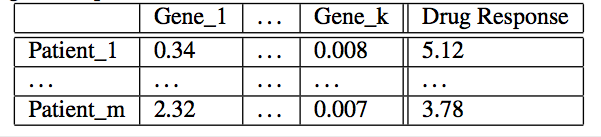

# GenBase: A Complex Analytics Genomics Benchmark

This paper introduces a new benchmark designed to test database management system performance on a mix of data management tasks and complex analysis. As a specific use case, we have chosen genomics data for our benchmark and have constructed a collection of typical tasks in this domain. In addition to being representative of a mix data management and analytics workload, this benchmark is also meant to scale to large data set sizes and multiple node across a cluster.

At the present time, we see a sea change occurring in DBMS analytics. Specifically, the previous focus has been on traditional BI where commercial products offer an easy to use GUI for standard SQL aggregates. We see the DBMS analytics market shifting quickly and dramatically to more complex analytics. This is the domain of data scientists where common operations include predictive modelling, data clustering, regressions, probabilistic modelling, and the like.

In summary, we believe it is important to focus the DBMS community on this new class of data science problems, which we can characterize by the following two requirements. 

- Data management
- Complex analytics

## Three Issue Concerns
**1. Integrated and Distribution**

Historically, such data science problems have been addressed by using a DBMS for the data management with some sort by using a DBMS for the data management with some sort of custom code or a statistics package for the analytics. In other words, a single software system should be capable of performing both kinds of operations, and we hope the proposed benchmark will focus attention in this area. 

In addition to calling for an integrated approach, we also see a need for such software systems to scale to data size large enough to span multiple nodes.

**2. Performance**
The complexity of matrix multiplication is cubic to the size of the arrays and performance can differ by several orders of magnitude depending on the choice of implementation language. 

Obtaining good performance on our proposed benchmark will require carefully optimizing both data management and the analytics operations.

**3. Specialized hardwar**
A third issue concerns specialized hardware. There has been recent interest in performing data management on accelerators such as GPUs, such accelerators are more adept at the computations found in complex analytics than they are at routine data management. 

To focus the community attention on all three issues, this paper presents a data science benchmark composed of both data management and complex analytics operations. 

## Why We Choose Genomics
1. Genomics is quickly becoming a significant source of petabytes of data
2. Current systems for genomics cannot handle data in this scale
3. The majority of analytics in genomics consists of a combinations of data management and statistics or linear algebra
4. Genomics is a societally important application domain to which the database community can contribute.

## Genomics Primer
DNA is commonly though of as the blueprint for all living organisms. In human, it is contained in the nucleus of each cell in our bodies, and encodes instructions for how each cell should grow and operate.

The DNA (genome) for an individual is a sequence of about **a billion** values from an alphabet of size 4 (ACTG). ACTG are four mulecules, also know known as nuleotides or bases that make up DNA.

**Genes are special subsequences of base pairs interspersed through out the genome** that are responsible for encoding traits inherited from our ancestors.

It's important to note that not every gene is transcribed and translated into protein in every cell. In reality, some genes are active and create high volumes of RNA and protein while other genes are less active.

Even though all cells in the human body contain the entire genetic code, only a subset of genes are actually active at any given time in any given cell. **The level of activity of a gene can be almost as important as the gene itself for determining phenotype.** AS a result, the mechanisms for regulating the expression of certain genes are active area of research. 

## Operations
The queries represent operations such as SVD, regression and statistics that are most commonly executed on microarray data. 

Genomics data can be extremely large scale, with $10^{4-5}$ gene expression per sample and up to $10^{8-10}$ samples.

## Data Set (Most important part)
The bench mark consists of four types of data set
1. microarray
2. patient metadata
3. gene metadata
4. gene ontology

### Microarray
This is the main dataset for all operations and is commonly represented as a matrix with row represents samples and columns representing genes.

### Patient metadata
For each patient whose genomic data is available in the microarray dataset, we store patient metadata including demographics and clinical information as noted below.

- Age
- Gender
- Zip code
- Disease
- Drug Response

### Gene metadata
For every gene in the microarray, we store gene metadata including the target of the gene, chromosome number, position, length and function

### Gene-ontology
Genes are organized into an ontology depending on the biological functions they serve. These categories from a tree structure, and a gene is placed at the appropriate place in the tree. 

## Queries
### Predictive Modelling
An important use case for genomic data is predicting drug response base on gene expression and using this information to determine drug regimens for patients.

Build a regression model predicting drug response based on gene expression data.

In this query, we select the expression data fro a subset of genes with a particular set of functions.

### Covariance
Genes that have similar expression patterns and those that have opposite expression patterns are likely to be functionally related

### Biclustering
An important goal of genomic analysis is to identify groups of genes and patients that show similar behaviour. Genes with similar behaviours are likely to be biologically related, and therefore can help understand disease pathways. One way to identify genes with similar behaviour is via biclustering. Biclustering allows the simultaneous clustering of rows and columns of a matrix into sub-matrices with similar patterns.

### SVD
As with much experimentally collected data, genomic data is quite noisy. We need to reduce the noise in the experimental data. A popular approach for performing this task is through the use of singular value decomposition. 

$$M = U \Sigma V$$

### Statistical test
An extremely common operation in genomic analysis is called enrichment.

Consider a set of genes $G$ that all participate in the same biological process. To determine if the set of genes $G$ is related to a particular disease, the entire known set of genes is ranked based on their expression values for cancer. Statistical tests are then used to find out where the members of G tend to occur in that ranking. If the members of G do occur at the top or bottom of the list. G is said to be correlate with cancer and metrits colser analysis for potential drug target. 

